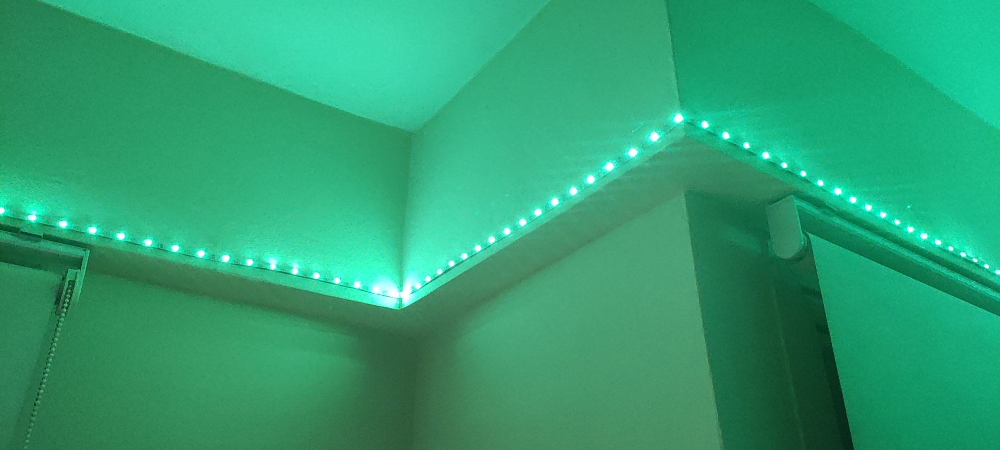
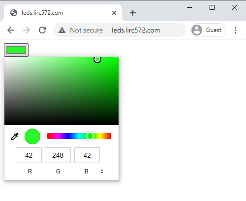

# LED-Strip-01S






## Setup

Clone this repository:

```bash
git clone https://github.com/lirc572/LED-Strip-01S.git
```

Create a `/src/config.h` file with relevant definitions:

```bash
cd LED-Strip-01S
echo '#define WIFI_SSID "YOUR_SSID"' >> src/config.h
echo '#define WIFI_PASSWORD "YOUR_PSWD"' >> src/config.h
echo '#define LED_PIN 2' >> src/config.h
echo '#define NUM_LEDS 150' >> src/config.h
```

Compile and upload the project with PlatformIO Core:

```bash
pio run -t upload
```

Or use the PlatformIO IDE.
